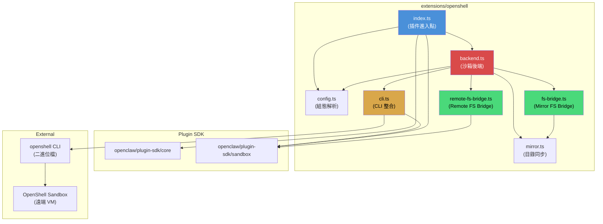
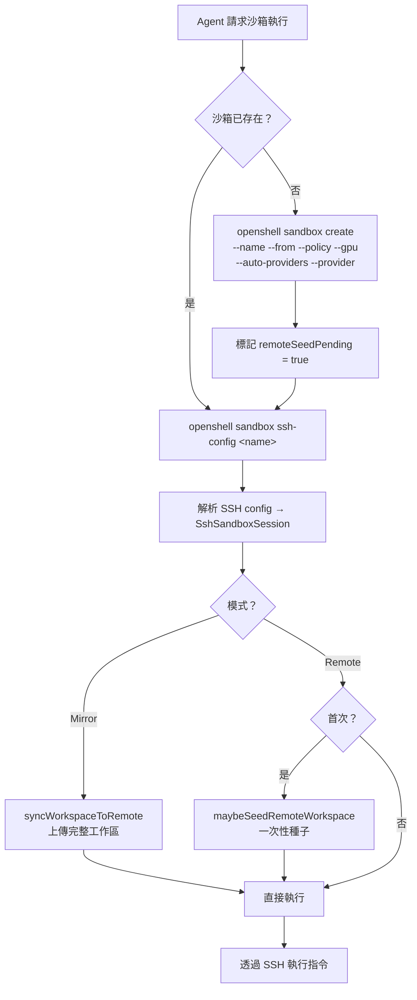
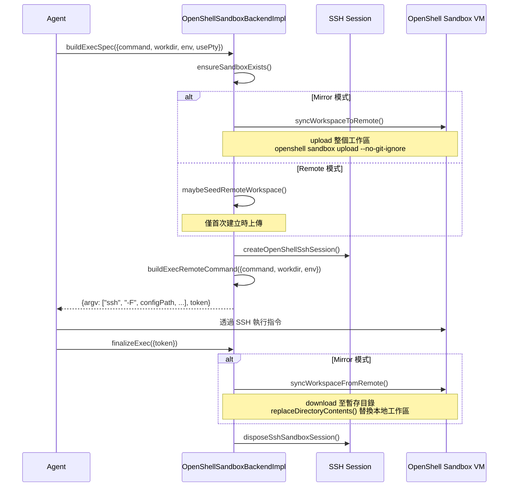
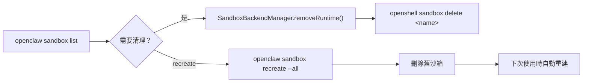
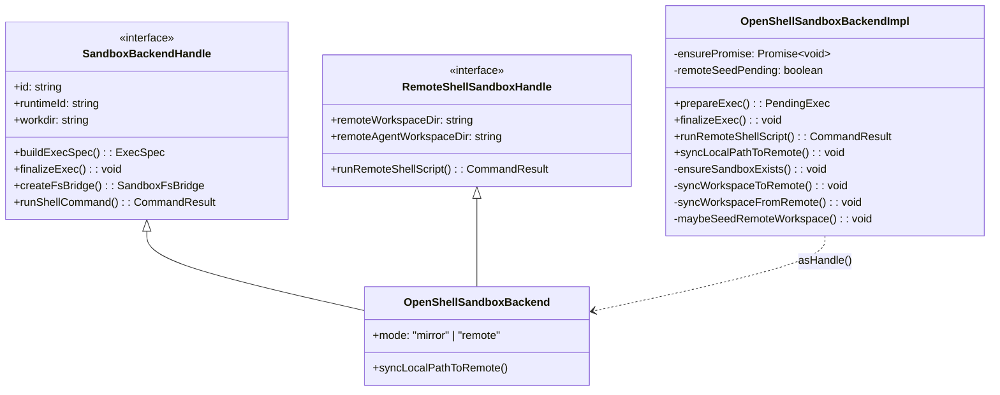
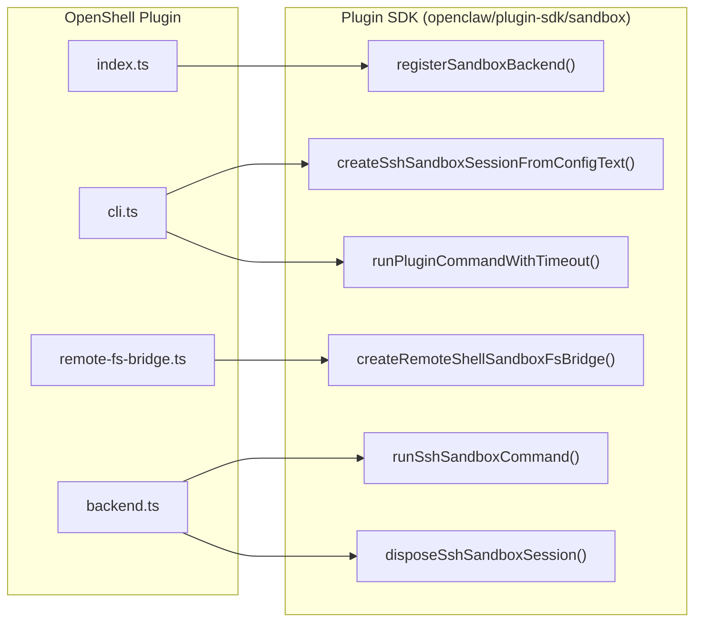

# OpenShell 架構概覽

## 元件關係圖

OpenShell 插件由五個核心模組組成，各自承擔不同職責：



### 模組職責

| 模組 | 檔案 | 職責 |
|------|------|------|
| **進入點** | `index.ts` | 定義插件 metadata，註冊 sandbox backend |
| **組態** | `config.ts` | 解析、驗證、套用預設值 |
| **CLI** | `cli.ts` | 封裝 `openshell` CLI 呼叫，管理 bundled fallback |
| **後端** | `backend.ts` | 核心邏輯：沙箱建立、指令執行、工作區同步 |
| **Mirror FS Bridge** | `fs-bridge.ts` | 本地檔案操作 + 遠端同步 |
| **Remote FS Bridge** | `remote-fs-bridge.ts` | 純 SSH 遠端檔案操作 |
| **同步工具** | `mirror.ts` | 目錄內容替換、跨檔案系統搬移 |

## 沙箱生命週期

### 建立階段

當 Agent 首次需要沙箱時，Backend 會依序執行以下步驟：



#### 沙箱命名策略

`buildOpenShellSandboxName(scopeKey)` 產生安全的沙箱名稱：

```typescript
// 範例：scopeKey = "my-project/session-42"
// 結果：openclaw-my-project-session-42-a3f7b2c1

function buildOpenShellSandboxName(scopeKey: string): string {
  const trimmed = scopeKey.trim() || "session";
  const safe = trimmed
    .toLowerCase()
    .replace(/[^a-z0-9._-]+/g, "-")  // 只保留安全字元
    .replace(/^-+|-+$/g, "")          // 去除首尾連字號
    .slice(0, 32);                     // 最多 32 字元
  // FNV-1a 雜湊確保唯一性
  const hash = Array.from(trimmed).reduce(
    (acc, char) => ((acc * 33) ^ char.charCodeAt(0)) >>> 0,
    5381,
  );
  return `openclaw-${safe || "session"}-${hash.toString(16).slice(0, 8)}`;
}
```

規則：
- 全部小寫，僅允許 `a-z0-9._-`
- 前綴 `openclaw-`，最大長度限制
- 附加 FNV-1a 雜湊後綴以防碰撞

### 執行階段



#### SSH 指令建構

`prepareExec()` 建構的 SSH 指令格式：

```bash
# 帶 PTY（互動式）
ssh -F /tmp/ssh-config-xxx \
    -tt -o RequestTTY=force -o SetEnv=TERM=xterm-256color \
    sandbox-host \
    "cd /sandbox && ENV_VAR=value exec command"

# 無 PTY（非互動式）
ssh -F /tmp/ssh-config-xxx \
    -T -o RequestTTY=no \
    sandbox-host \
    "cd /sandbox && ENV_VAR=value exec command"
```

### 清理階段



Manager 提供兩個操作：

| 操作 | CLI 指令 | 說明 |
|------|----------|------|
| `describeRuntime()` | `openshell sandbox get <name>` | 查詢沙箱狀態 |
| `removeRuntime()` | `openshell sandbox delete <name>` | 刪除沙箱 |

## 資料流：Mirror vs Remote

### Mirror 模式資料流

```
每次 exec 週期：

    ┌─────────────┐         upload           ┌──────────────┐
    │  本地工作區  ├────────────────────────►│  /sandbox    │
    │  (canonical) │                          │  (遠端 VM)   │
    │             │◄────────────────────────┤              │
    └─────────────┘        download          └──────────────┘
          ▲                                        │
          │                                        │
    本地檔案操作                              SSH 指令執行
    (writeFile → 寫本地 → syncLocalPathToRemote)
```

**特點：**
- 本地工作區是 source of truth
- 每次 `exec` 前上傳、後下載（成本較高）
- 檔案寫入先寫本地，再同步至遠端
- 適合開發工作流，本地編輯即時可見

### Remote 模式資料流

```
首次建立：

    ┌─────────────┐      一次性 seed        ┌──────────────┐
    │  本地工作區  ├───────────────────────►│  /sandbox    │
    │             │                          │  (canonical) │
    └─────────────┘                          └──────┬───────┘
                                                    │
後續操作：                                          │
                                              SSH 直接操作
    所有 read/write/exec ──────────────────►  (無本地同步)
```

**特點：**
- 遠端工作區是 source of truth
- 僅首次種子時上傳一次
- 所有檔案操作透過 SSH shell script 直接在遠端執行
- 較低的每次 exec 開銷，適合長時間運行的 Agent 或 CI

## Backend 實作類別結構



### 關鍵設計模式

1. **Promise 去重 (Deduplication)**：`ensureSandboxExists()` 使用 `ensurePromise` 防止並發建立
2. **延遲種子 (Lazy Seeding)**：`remoteSeedPending` 確保 Remote 模式僅在首次執行時種子
3. **Handle 模式**：`asHandle()` 將 impl 包裝為公開介面，隱藏內部狀態
4. **Factory + Manager 分離**：建立邏輯（Factory）與管理邏輯（Manager）解耦

## 與 Plugin SDK 的整合點



插件透過 Plugin SDK 的公開 API 進行所有跨套件互動，保持清晰的匯入邊界。
