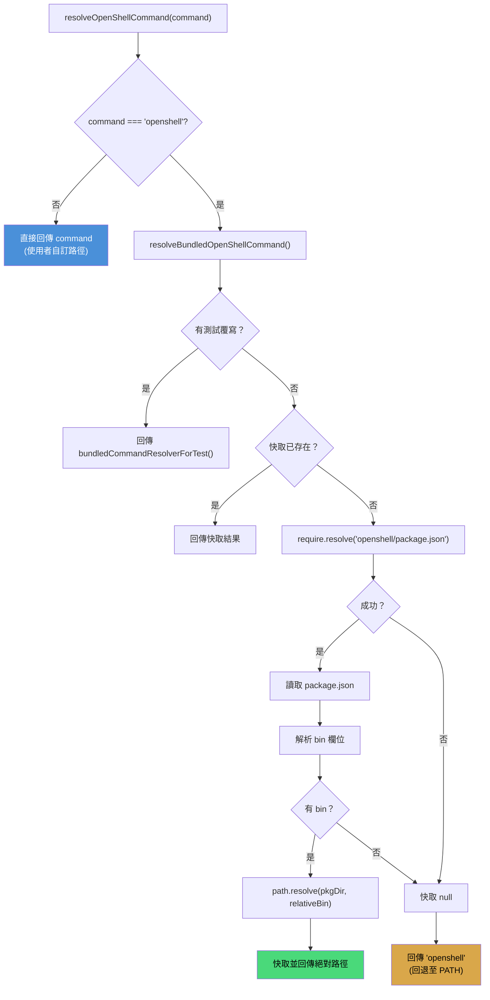
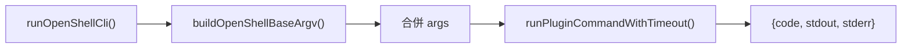
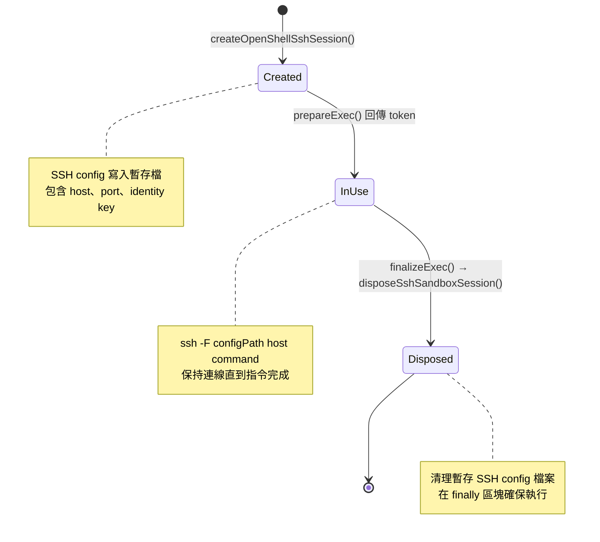

# CLI 整合與 Bundled Fallback

## 概述

`cli.ts` 是 OpenShell 插件與 `openshell` CLI 之間的橋接層。它處理三個關鍵問題：

1. **如何找到 `openshell` 二進位檔？** -- Bundled Fallback 機制
2. **如何建構 CLI 指令？** -- Base argv 與 gateway 旗標
3. **如何執行指令並建立 SSH 會話？** -- 逾時管理與 SSH config 解析

## Bundled CLI Fallback 機制

### 問題

部署環境中，`openshell` CLI 可能：
- 已安裝至系統 PATH（全域安裝）
- 作為 npm 依賴打包在插件的 `node_modules` 中（bundled）
- 兩者皆有，或都沒有

### 解決方案：三階段解析



### 原始碼解析

```typescript
// 使用 CommonJS require 來解析 node_modules 中的套件
const require = createRequire(import.meta.url);

// 快取層：undefined = 未解析, null = 解析失敗, string = 成功路徑
let cachedBundledOpenShellCommand: string | null | undefined;

function resolveBundledOpenShellCommand(): string | null {
  // 1. 測試覆寫優先
  if (bundledCommandResolverForTest) {
    return bundledCommandResolverForTest();
  }
  // 2. 快取命中
  if (cachedBundledOpenShellCommand !== undefined) {
    return cachedBundledOpenShellCommand;
  }
  try {
    // 3. 透過 require.resolve 找到 openshell 套件
    const packageJsonPath = require.resolve("openshell/package.json");
    const packageJson = JSON.parse(
      fs.readFileSync(packageJsonPath, "utf8")
    );
    // 4. 解析 bin 欄位（支援 string 或 {openshell: string} 格式）
    const relativeBin =
      typeof packageJson.bin === "string"
        ? packageJson.bin
        : packageJson.bin?.openshell;
    // 5. 轉換為絕對路徑
    cachedBundledOpenShellCommand = relativeBin
      ? path.resolve(path.dirname(packageJsonPath), relativeBin)
      : null;
  } catch {
    // 6. 套件不存在 → 快取 null
    cachedBundledOpenShellCommand = null;
  }
  return cachedBundledOpenShellCommand;
}
```

### 解析策略總覽

```
優先順序（高 → 低）：

1. 使用者自訂路徑
   config.command = "/usr/local/bin/openshell-v2"
   → 直接使用，不經過任何解析

2. Bundled binary（透過 node_modules）
   require.resolve("openshell/package.json")
   → /path/to/extensions/openshell/node_modules/openshell/package.json
   → 讀取 bin 欄位 → 轉為絕對路徑
   → /path/to/.../node_modules/openshell/bin/openshell

3. 系統 PATH 回退
   → 直接使用 "openshell" 字串
   → 由作業系統的 PATH 搜尋機制解析
```

### 為什麼需要 Bundled Fallback？

| 場景 | 沒有 Bundled Fallback | 有 Bundled Fallback |
|------|----------------------|---------------------|
| CI/CD 環境 | 需要額外步驟安裝 openshell | 自動使用打包的版本 |
| 版本不一致 | 可能使用到錯誤版本 | 保證使用相容版本 |
| 隔離部署 | PATH 汙染風險 | 模組內部自足 |
| 多版本共存 | 困難 | 每個插件可用不同版本 |

### 快取行為

```typescript
// 三態快取：
// undefined → 尚未解析（首次呼叫會觸發解析）
// null      → 已解析但找不到 bundled binary
// string    → 已解析的絕對路徑

// 重要：快取在 process 生命週期內持續有效
// 不會因為 node_modules 變更而自動失效
```

## Base Argv 建構

`buildOpenShellBaseArgv()` 產生所有 `openshell` CLI 呼叫的基礎指令陣列：

```typescript
function buildOpenShellBaseArgv(config: ResolvedOpenShellPluginConfig): string[] {
  const argv = [resolveOpenShellCommand(config.command)];
  if (config.gateway) {
    argv.push("--gateway", config.gateway);
  }
  if (config.gatewayEndpoint) {
    argv.push("--gateway-endpoint", config.gatewayEndpoint);
  }
  return argv;
}
```

### 範例輸出

```bash
# 最小配置
["/path/to/node_modules/openshell/bin/openshell"]

# 帶 gateway
["/path/to/node_modules/openshell/bin/openshell", "--gateway", "lab"]

# 帶 gateway + endpoint
["/path/to/node_modules/openshell/bin/openshell",
 "--gateway", "lab",
 "--gateway-endpoint", "https://lab.example.com"]

# 使用者自訂路徑 + gateway
["/usr/local/bin/openshell-v2", "--gateway", "production"]
```

## 指令執行

### runOpenShellCli

所有 OpenShell CLI 呼叫都經過 `runOpenShellCli()`：

```typescript
async function runOpenShellCli(params: {
  context: OpenShellExecContext;
  args: string[];          // 子指令與參數
  cwd?: string;            // 工作目錄
  timeoutMs?: number;      // 逾時覆寫
}): Promise<{ code: number; stdout: string; stderr: string }>
```

逾時優先順序：
1. `params.timeoutMs` -- 呼叫端明確指定
2. `params.context.timeoutMs` -- 執行上下文指定
3. `params.context.config.timeoutMs` -- 組態預設值（預設 120 秒）



### 常見 CLI 操作

| 操作 | 參數 | 說明 |
|------|------|------|
| 查詢沙箱 | `["sandbox", "get", name]` | 檢查沙箱是否存在 |
| 建立沙箱 | `["sandbox", "create", "--name", name, ...]` | 新建沙箱 |
| 刪除沙箱 | `["sandbox", "delete", name]` | 移除沙箱 |
| SSH 設定 | `["sandbox", "ssh-config", name]` | 取得 SSH 連線資訊 |
| 上傳檔案 | `["sandbox", "upload", "--no-git-ignore", name, src, dst]` | 上傳至沙箱 |
| 下載檔案 | `["sandbox", "download", name, src, dst]` | 從沙箱下載 |

## SSH 會話建立

```typescript
async function createOpenShellSshSession(params: {
  context: OpenShellExecContext;
}): Promise<SshSandboxSession> {
  // 1. 執行 openshell sandbox ssh-config <name>
  const result = await runOpenShellCli({
    context: params.context,
    args: ["sandbox", "ssh-config", params.context.sandboxName],
  });
  if (result.code !== 0) {
    throw new Error(result.stderr.trim() || "openshell sandbox ssh-config failed");
  }
  // 2. 解析 SSH config 文字為 SshSandboxSession
  return await createSshSandboxSessionFromConfigText({
    configText: result.stdout,
  });
}
```

### SSH 會話生命週期



## 測試覆寫機制

為了在單元測試中控制 bundled CLI 的行為，`cli.ts` 提供了測試注入點：

```typescript
// 設定測試覆寫
export function setBundledOpenShellCommandResolverForTest(
  resolver?: () => string | null
): void {
  bundledCommandResolverForTest = resolver;
  cachedBundledOpenShellCommand = undefined;  // 清除快取
}

// 測試範例
describe("cli", () => {
  afterEach(() => {
    // 每個測試後重置
    setBundledOpenShellCommandResolverForTest(undefined);
  });

  it("優先使用 bundled openshell", () => {
    setBundledOpenShellCommandResolverForTest(
      () => "/mock/bundled/openshell"
    );
    const argv = buildOpenShellBaseArgv(defaultConfig);
    expect(argv[0]).toBe("/mock/bundled/openshell");
  });

  it("bundled 不可用時回退至 PATH", () => {
    setBundledOpenShellCommandResolverForTest(() => null);
    const argv = buildOpenShellBaseArgv(defaultConfig);
    expect(argv[0]).toBe("openshell");
  });
});
```

## Shell 逸出

`cli.ts` 重新匯出 Plugin SDK 的 `shellEscape` 與 `buildExecRemoteCommand`：

```typescript
// 安全地建構遠端指令
const remoteCmd = buildExecRemoteCommand({
  command: "npm test",
  workdir: "/sandbox",
  env: { NODE_ENV: "test", CI: "true" },
});
// 結果: cd '/sandbox' && NODE_ENV='test' CI='true' exec npm test

// 單獨逸出
shellEscape("hello world");  // → 'hello world'
shellEscape("it's");         // → 'it'"'"'s'
```

## 疑難排解

### openshell: command not found

1. 確認 `openshell` 已安裝：
   ```bash
   which openshell
   ```
2. 若使用 bundled 方式，確認 `extensions/openshell/node_modules/openshell` 存在
3. 可設定絕對路徑繞過解析：
   ```json5
   plugins: {
     entries: {
       openshell: {
         config: { command: "/usr/local/bin/openshell" }
       }
     }
   }
   ```

### SSH 連線失敗

1. 確認 `openshell sandbox ssh-config <name>` 可正常執行
2. 檢查 SSH key 權限
3. 確認 gateway endpoint 可達
