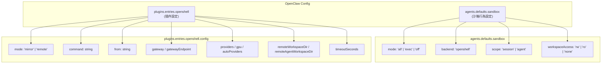
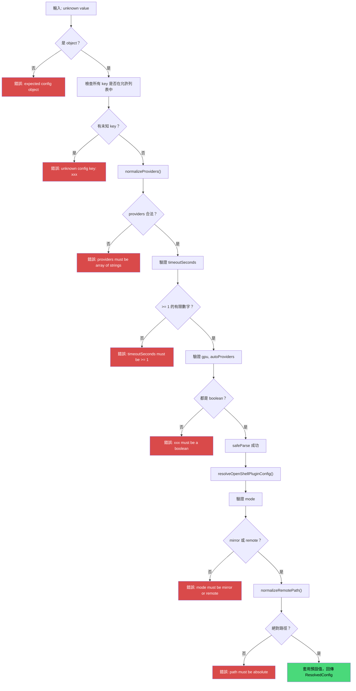

# 組態系統與部署指南

## 組態結構

OpenShell 的組態分為兩層：



## 完整組態參考

### 型別定義

```typescript
// 原始組態（所有欄位皆為可選）
type OpenShellPluginConfig = {
  mode?: string;
  command?: string;
  gateway?: string;
  gatewayEndpoint?: string;
  from?: string;
  policy?: string;
  providers?: string[];
  gpu?: boolean;
  autoProviders?: boolean;
  remoteWorkspaceDir?: string;
  remoteAgentWorkspaceDir?: string;
  timeoutSeconds?: number;
};

// 解析後組態（所有必要欄位皆有值）
type ResolvedOpenShellPluginConfig = {
  mode: "mirror" | "remote";    // 已驗證的工作模式
  command: string;               // CLI 指令或路徑
  gateway?: string;              // 可選 gateway 名稱
  gatewayEndpoint?: string;      // 可選 gateway URL
  from: string;                  // 沙箱來源
  policy?: string;               // 可選政策檔案
  providers: string[];           // 已去重的 provider 列表
  gpu: boolean;                  // GPU 請求
  autoProviders: boolean;        // 自動建立 providers
  remoteWorkspaceDir: string;    // 遠端工作區路徑（已正規化）
  remoteAgentWorkspaceDir: string; // 遠端 agent 路徑（已正規化）
  timeoutMs: number;             // 逾時（毫秒，由 seconds 轉換）
};
```

### 欄位詳細說明

| 欄位 | 型別 | 預設值 | 說明 |
|------|------|--------|------|
| `mode` | `"mirror"` \| `"remote"` | `"mirror"` | 工作區同步模式。Mirror 為雙向同步，Remote 為單次種子後直接遠端操作 |
| `command` | `string` | `"openshell"` | `openshell` CLI 的路徑或指令名稱。設為 `"openshell"` 時觸發 bundled fallback |
| `gateway` | `string` | -- | OpenShell gateway 名稱，對應 `--gateway` 旗標 |
| `gatewayEndpoint` | `string` | -- | OpenShell gateway endpoint URL，對應 `--gateway-endpoint` 旗標 |
| `from` | `string` | `"openclaw"` | 沙箱映像來源，用於 `openshell sandbox create --from` |
| `policy` | `string` | -- | 自訂沙箱政策 YAML 檔案路徑 |
| `providers` | `string[]` | `[]` | 建立沙箱時附加的 provider 名稱。重複項會自動去除 |
| `gpu` | `boolean` | `false` | 建立沙箱時請求 GPU 資源 |
| `autoProviders` | `boolean` | `true` | 是否傳遞 `--auto-providers`（否則傳 `--no-auto-providers`） |
| `remoteWorkspaceDir` | `string` | `"/sandbox"` | 沙箱內的主要可寫工作區路徑。必須為絕對路徑 |
| `remoteAgentWorkspaceDir` | `string` | `"/agent"` | Agent 工作區掛載路徑（用於 read-only 存取模式） |
| `timeoutSeconds` | `number` | `120` | CLI 操作逾時（秒）。最小值 1。內部轉換為毫秒 |

## 驗證邏輯

`resolveOpenShellPluginConfig()` 執行以下驗證：



### Provider 正規化

```typescript
function normalizeProviders(value: unknown): string[] | null {
  if (value === undefined) return [];     // 未提供 → 空陣列
  if (!Array.isArray(value)) return null; // 非陣列 → 錯誤

  const seen = new Set<string>();
  const providers: string[] = [];
  for (const entry of value) {
    if (typeof entry !== "string" || !entry.trim()) return null;
    const normalized = entry.trim();
    if (seen.has(normalized)) continue;  // 自動去重
    seen.add(normalized);
    providers.push(normalized);
  }
  return providers;
}
```

### 路徑正規化

```typescript
function normalizeRemotePath(value: string | undefined, fallback: string): string {
  const candidate = value ?? fallback;
  // 使用 POSIX 格式正規化
  const normalized = path.posix.normalize(candidate.trim() || fallback);
  if (!normalized.startsWith("/")) {
    throw new Error(`OpenShell remote path must be absolute: ${candidate}`);
  }
  return normalized;
}
```

## 部署情境範例

### 情境一：開發環境（Mirror 模式）

適合需要在本地 IDE 編輯並即時看到沙箱變更的開發者：

```json5
{
  agents: {
    defaults: {
      sandbox: {
        mode: "all",
        backend: "openshell",
        scope: "session",       // 每個 session 一個沙箱
        workspaceAccess: "rw",  // 可讀寫
      },
    },
  },
  plugins: {
    entries: {
      openshell: {
        enabled: true,
        config: {
          from: "openclaw",
          mode: "mirror",        // 雙向同步
          timeoutSeconds: 180,   // 較長逾時以應對大工作區
        },
      },
    },
  },
}
```

### 情境二：CI/CD（Remote 模式）

適合自動化流程，不需本地同步：

```json5
{
  agents: {
    defaults: {
      sandbox: {
        mode: "all",
        backend: "openshell",
        scope: "agent",          // 每個 agent 一個沙箱
        workspaceAccess: "rw",
      },
    },
  },
  plugins: {
    entries: {
      openshell: {
        enabled: true,
        config: {
          from: "openclaw",
          mode: "remote",        // 單次種子
          autoProviders: true,
          timeoutSeconds: 300,   // CI 可能需要更長逾時
        },
      },
    },
  },
}
```

### 情境三：GPU 工作負載

需要 GPU 的機器學習或推理任務：

```json5
{
  agents: {
    defaults: {
      sandbox: {
        mode: "all",
        backend: "openshell",
        scope: "agent",
        workspaceAccess: "rw",
      },
    },
  },
  plugins: {
    entries: {
      openshell: {
        enabled: true,
        config: {
          from: "openclaw",
          mode: "remote",
          gpu: true,             // 請求 GPU
          providers: ["openai"], // 附加 OpenAI provider
          timeoutSeconds: 600,   // ML 任務可能較久
        },
      },
    },
  },
}
```

### 情境四：自訂 Gateway + 嚴格政策

企業環境中使用私有 gateway 與安全政策：

```json5
{
  agents: {
    defaults: {
      sandbox: { mode: "off" },      // 預設關閉
    },
    list: [
      {
        id: "secure-researcher",
        sandbox: {
          mode: "all",
          backend: "openshell",
          scope: "agent",
          workspaceAccess: "rw",
        },
      },
    ],
  },
  plugins: {
    entries: {
      openshell: {
        enabled: true,
        config: {
          from: "enterprise-base",
          mode: "remote",
          gateway: "internal-lab",
          gatewayEndpoint: "https://openshell.internal.company.com",
          policy: "/etc/openclaw/strict-policy.yaml",
          autoProviders: false,      // 不自動建立
          providers: ["approved-llm"], // 僅允許核准的 provider
        },
      },
    },
  },
}
```

### 情境五：Per-Agent 覆寫

不同 Agent 使用不同的沙箱設定：

```json5
{
  agents: {
    defaults: {
      sandbox: {
        mode: "all",
        backend: "openshell",
        scope: "agent",
      },
    },
    list: [
      {
        id: "coder",
        // 使用全域預設的 openshell 設定
      },
      {
        id: "researcher",
        sandbox: {
          mode: "all",
          backend: "openshell",
          scope: "session",        // 覆寫 scope
          workspaceAccess: "ro",   // 唯讀
        },
      },
    ],
  },
  plugins: {
    entries: {
      openshell: {
        enabled: true,
        config: {
          from: "openclaw",
          mode: "remote",
        },
      },
    },
  },
}
```

## 組態覆寫機制

Manager 的 `describeRuntime()` 支援從 OpenClaw config 動態覆寫插件組態：

```typescript
function resolveOpenShellPluginConfigFromConfig(
  config: OpenClawConfig,                      // 當前 OpenClaw 組態
  fallback: ResolvedOpenShellPluginConfig,      // 插件初始化時的組態
): ResolvedOpenShellPluginConfig {
  const pluginConfig = config.plugins?.entries?.openshell?.config;
  if (!pluginConfig) return fallback;           // 無覆寫 → 使用預設
  return resolveOpenShellPluginConfig(pluginConfig); // 重新解析覆寫值
}
```

## 何時需要 recreate

修改以下設定後，必須重新建立沙箱：

| 變更的設定 | 為什麼需要 recreate |
|-----------|-------------------|
| `backend` | 切換後端類型 |
| `from` | 沙箱映像已不同 |
| `mode` | 同步策略根本改變 |
| `policy` | 安全政策需要重新套用 |

```bash
openclaw sandbox recreate --all
```

## 疑難排解

### 沙箱建立失敗

```
Error: openshell sandbox create failed
```

1. 確認 `openshell` CLI 可正常執行
2. 檢查帳號權限：`openshell auth status`
3. 確認 gateway 可達（如有設定）
4. 增加 `timeoutSeconds`（預設 120 秒可能不夠）

### 上傳/下載超時

```
Error: openshell sandbox upload failed
```

1. 檢查工作區大小，考慮切換至 Remote 模式
2. 增加 `timeoutSeconds`
3. 確認網路連線穩定

### 路徑錯誤

```
Error: OpenShell remote path must be absolute: relative/path
```

`remoteWorkspaceDir` 和 `remoteAgentWorkspaceDir` 必須為絕對路徑（以 `/` 開頭）。

### Provider 設定錯誤

```
Error: providers must be an array of strings
```

確認 `providers` 是字串陣列格式：
```json5
// 正確
providers: ["openai", "anthropic"]
// 錯誤
providers: "openai"
providers: [123]
```
