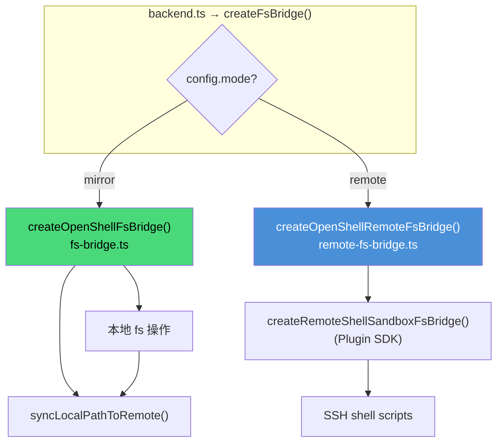
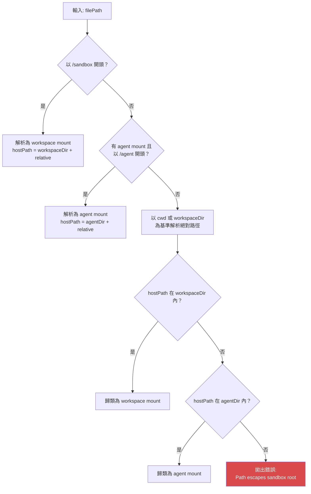
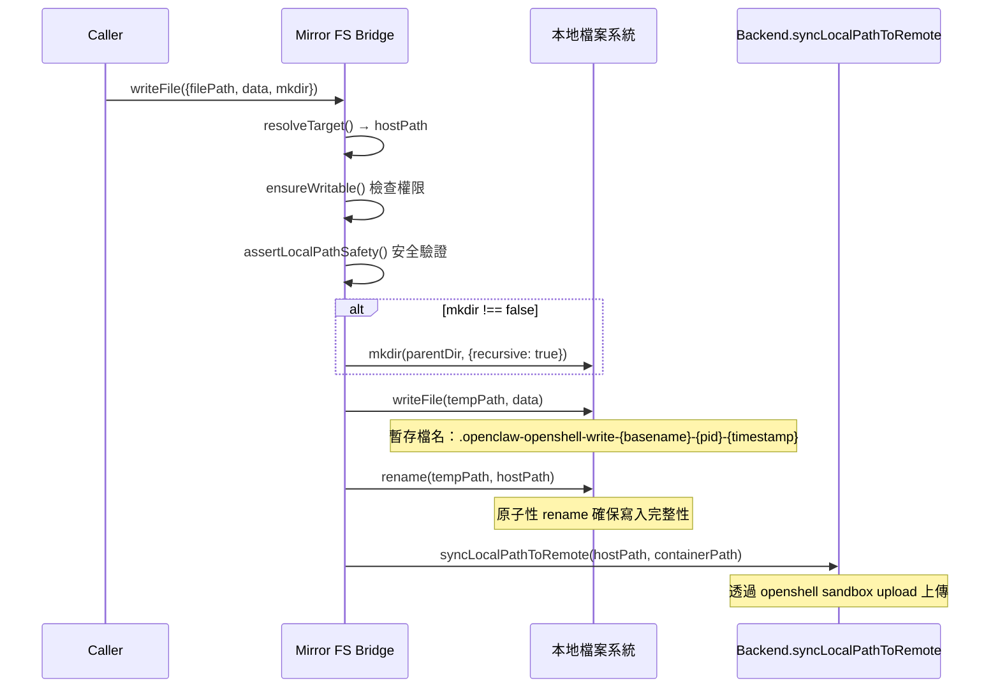
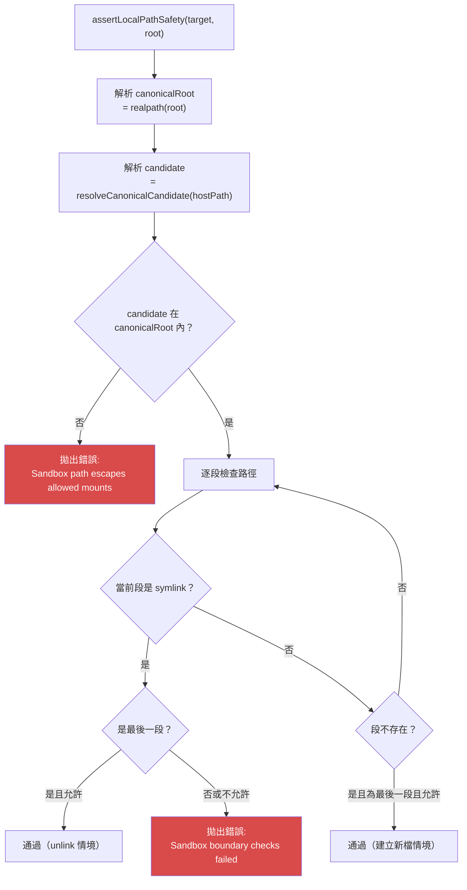
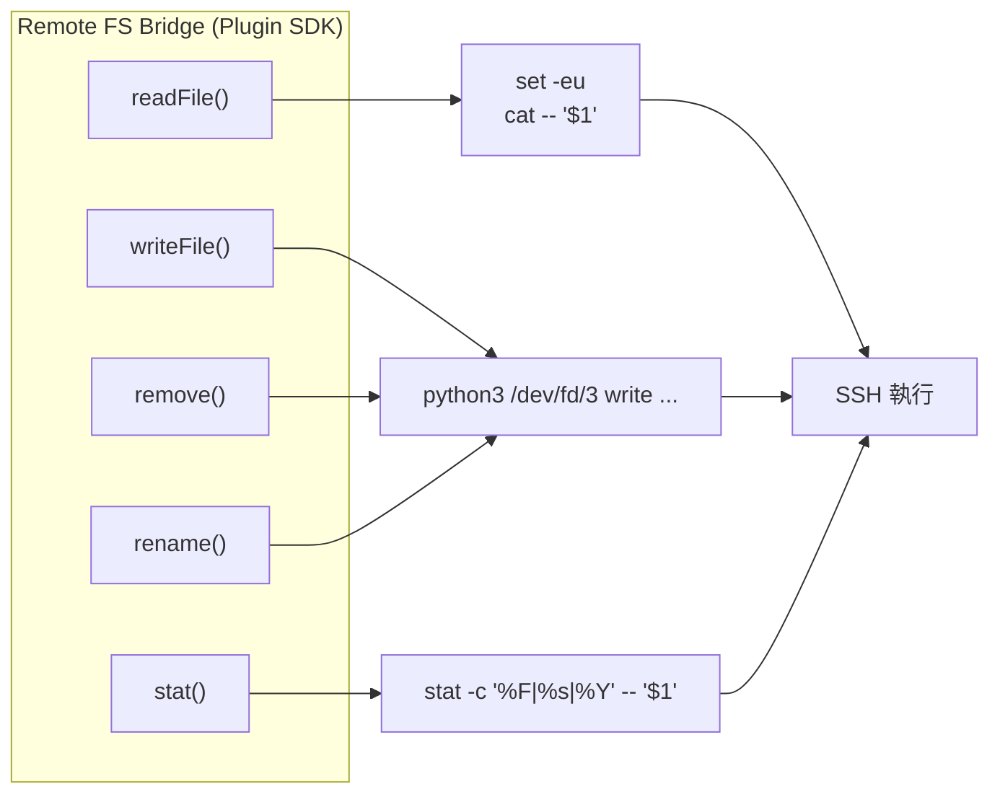
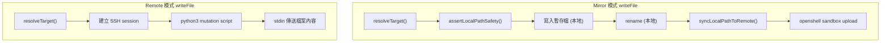

# 檔案系統橋接器深入分析

## 概述

OpenShell 插件根據工作模式提供兩種截然不同的檔案系統橋接器（FS Bridge）：

| | Mirror FS Bridge | Remote FS Bridge |
|---|---|---|
| **檔案** | `fs-bridge.ts` | `remote-fs-bridge.ts` |
| **實作** | 自行實作 `SandboxFsBridge` | 委派至 Plugin SDK |
| **資料位置** | 本地 + 遠端雙寫 | 僅遠端 |
| **hostPath** | 有（本地路徑） | 無（`undefined`） |
| **原子性** | 本地 temp+rename | 遠端 Python3 script |
| **行數** | ~356 行 | ~16 行 |



## Mirror FS Bridge

### 雙掛載點架構

Mirror Bridge 支援兩個掛載點，對應到遠端沙箱中的兩個目錄：

```
本地主機                           遠端沙箱

workspaceDir ─────────────── /sandbox (containerWorkdir)
  (可讀寫)                      主要工作區

agentWorkspaceDir ────────── /agent (remoteAgentWorkspaceDir)
  (可讀寫)                      Agent 專用工作區
```

雙掛載啟用的條件：
1. `workspaceAccess !== "none"`
2. `workspaceDir !== agentWorkspaceDir`（兩者不是同一目錄）

### 路徑解析流程

`resolveTarget()` 方法將使用者提供的路徑解析為 `ResolvedMountPath`：



### ResolvedMountPath 型別

```typescript
type ResolvedMountPath = SandboxResolvedPath & {
  mountHostRoot: string;      // 掛載根目錄（本地）
  writable: boolean;          // workspaceAccess === "rw"
  source: "workspace" | "agent";  // 來源掛載點
};

// SandboxResolvedPath:
// {
//   hostPath?: string;       // 本地檔案路徑
//   relativePath: string;    // 相對路徑
//   containerPath: string;   // 容器內路徑（/sandbox/...）
// }
```

### 範例：路徑解析

```typescript
// 場景：workspaceDir=/home/user/project, containerWorkdir=/sandbox

// Case 1: 容器路徑
resolvePath({ filePath: "/sandbox/src/main.ts" })
// → hostPath: "/home/user/project/src/main.ts"
// → containerPath: "/sandbox/src/main.ts"
// → source: "workspace"

// Case 2: 相對路徑
resolvePath({ filePath: "src/main.ts" })
// → hostPath: "/home/user/project/src/main.ts"
// → containerPath: "/sandbox/src/main.ts"
// → source: "workspace"

// Case 3: Agent 掛載
resolvePath({ filePath: "/agent/data/model.bin" })
// → hostPath: "/home/user/agent-workspace/data/model.bin"
// → containerPath: "/agent/data/model.bin"
// → source: "agent"

// Case 4: 越界 → 錯誤
resolvePath({ filePath: "/etc/passwd" })
// → Error: Path escapes sandbox root
```

### 檔案操作與安全機制

#### writeFile -- 原子寫入 + 遠端同步



為什麼使用 temp+rename 策略？
- **原子性**：如果寫入過程中斷，原檔案不受影響
- **一致性**：讀取端不會看到部分寫入的內容
- **跨平台**：POSIX `rename()` 在同一檔案系統上是原子操作

#### readFile -- 安全讀取

```typescript
async readFile(params): Promise<Buffer> {
  const target = this.resolveTarget(params);
  const hostPath = this.requireHostPath(target);
  // 安全驗證：防止 symlink 越界
  await assertLocalPathSafety({
    target,
    root: target.mountHostRoot,
    allowMissingLeaf: false,
    allowFinalSymlinkForUnlink: false,
  });
  return await fsPromises.readFile(hostPath);
}
```

#### remove -- 本地刪除 + 遠端清理

```typescript
// 遠端刪除策略根據是否遞迴而不同：
const remoteScript = params.recursive
  ? 'rm -rf -- "$1"'                    // 遞迴：直接 rm -rf
  : 'if [ -d "$1" ] && [ ! -L "$1" ]; then rmdir -- "$1"; ' +
    'elif [ -e "$1" ] || [ -L "$1" ]; then rm -f -- "$1"; fi';
    // 非遞迴：目錄用 rmdir（必須為空），檔案用 rm -f
```

#### rename -- 跨檔案系統支援

```typescript
// 本地 rename 使用 movePathWithCopyFallback：
async function movePathWithCopyFallback(params) {
  try {
    await fs.rename(params.from, params.to);  // 嘗試原子 rename
  } catch (error) {
    if (error.code !== "EXDEV") throw error;  // 非跨裝置錯誤 → 重新拋出
    // EXDEV = 跨檔案系統 → 用 copy + delete 替代
    await fs.cp(params.from, params.to, {
      recursive: true, force: true, dereference: false
    });
    await fs.rm(params.from, { recursive: true, force: true });
  }
}
```

### 安全機制：assertLocalPathSafety

此函式防止透過 symlink 進行路徑逃逸攻擊：



#### 攻擊情境範例

```
攻擊：在沙箱內建立 symlink 指向外部
/sandbox/evil → /etc/passwd

防禦流程：
1. resolveTarget("/sandbox/evil") → hostPath="/home/user/project/evil"
2. assertLocalPathSafety 開始逐段檢查
3. 發現 "evil" 是 symlink
4. allowFinalSymlinkForUnlink=false → 拋出錯誤
```

#### resolveCanonicalCandidate

處理部分路徑不存在的情況（如寫入新檔案）：

```typescript
// 從路徑末端向上走，找到第一個存在的祖先
// 對該祖先做 realpath()，再接回剩餘的路徑段
async function resolveCanonicalCandidate(targetPath: string): Promise<string> {
  const missing: string[] = [];
  let cursor = path.resolve(targetPath);
  while (true) {
    const exists = await fs.lstat(cursor).then(() => true).catch(() => false);
    if (exists) {
      const canonical = await fs.realpath(cursor).catch(() => cursor);
      return path.resolve(canonical, ...missing);
    }
    const parent = path.dirname(cursor);
    if (parent === cursor) break;
    missing.unshift(path.basename(cursor));
    cursor = parent;
  }
}
```

## Remote FS Bridge

### 架構

Remote Bridge 本身只有 16 行，是一個薄包裝：

```typescript
export function createOpenShellRemoteFsBridge(params: {
  sandbox: SandboxContext;
  backend: RemoteShellSandboxHandle;
}): SandboxFsBridge {
  return createRemoteShellSandboxFsBridge({
    sandbox: params.sandbox,
    runtime: params.backend,
  });
}
```

所有實際邏輯委派給 Plugin SDK 的 `createRemoteShellSandboxFsBridge()`。

### 運作方式

Remote Bridge 透過 `runRemoteShellScript()` 在遠端執行 shell script 來操作檔案：



### 遠端 Shell Script 對照表

| 操作 | Shell Script | 說明 |
|------|-------------|------|
| **讀取檔案** | `set -eu; cat -- "$1"` | 直接 cat 輸出至 stdout |
| **檔案存在** | `if [ -e "$1" ] \|\| [ -L "$1" ]; then printf "1\n"; else printf "0\n"; fi` | 含 symlink 檢查 |
| **canonicalize** | `canonical=$(readlink -f -- "$cursor")` | 解析真實路徑 |
| **型別+硬連結** | `stat -c "%F\|%h" -- "$1"` | 判斷檔案類型 |
| **完整 stat** | `stat -c "%F\|%s\|%Y" -- "$1"` | 類型、大小、修改時間 |
| **寫入/刪除/重命名** | `python3 /dev/fd/3 "$@" 3<<'PY'` | Python3 原子操作腳本 |

### Python3 原子操作腳本

Remote 模式使用 Python3 進行需要原子性的操作：

```python
# 寫入操作 (概念)
# args: write <root> <relativeParent> <basename> <mkdir>
# stdin: 檔案內容

import os, sys
operation = sys.argv[1]
if operation == "write":
    root, parent, basename, mkdir = sys.argv[2:6]
    full_parent = os.path.join(root, parent)
    if mkdir == "1":
        os.makedirs(full_parent, exist_ok=True)
    with open(os.path.join(full_parent, basename), 'wb') as f:
        f.write(sys.stdin.buffer.read())
```

支援的操作：
- `write` -- 寫入檔案（可自動建立父目錄）
- `mkdirp` -- 遞迴建立目錄
- `remove` -- 刪除檔案/目錄（支援 recursive/force 旗標）
- `rename` -- 重命名/搬移（可自動建立目標父目錄）

## 效能比較



| 指標 | Mirror | Remote |
|------|--------|--------|
| **readFile 延遲** | 低（本地 fs） | 高（SSH 往返） |
| **writeFile 延遲** | 中（本地 + 上傳） | 中（SSH + script） |
| **exec 前開銷** | 高（全量上傳） | 低（僅首次種子） |
| **exec 後開銷** | 高（全量下載） | 無 |
| **大檔案讀取** | 快（本地 I/O） | 慢（SSH 傳輸） |
| **頻繁小寫入** | 尚可（每次觸發 upload） | 較好（直接遠端操作） |

### 選擇建議

```
你的工作流偏向？

├── 頻繁在本地編輯、需要雙向同步
│   → Mirror 模式
│
├── 長時間運行的 Agent、CI/CD
│   → Remote 模式
│
├── 大型工作區（>1GB）
│   → Remote 模式（避免每次 exec 的全量同步）
│
└── 需要本地 IDE 同步
    → Mirror 模式
```
