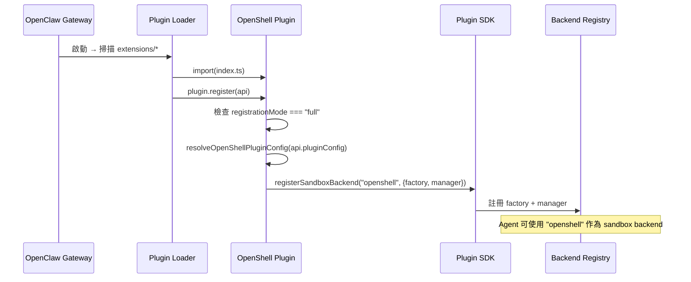

# OpenShell 插件技術文件

本文件以工程師與部署者的視角，完整介紹 OpenClaw 的 OpenShell 沙箱後端插件。涵蓋架構設計、模組分析、安全機制、近期變更以及部署實務。

## 文件結構

| 文件 | 內容 |
|------|------|
| [架構概覽](architecture) | 整體架構、元件關係、生命週期流程 |
| [CLI 整合與 Bundled Fallback](cli-bundled-fallback) | CLI 解析機制、bundled binary 回退策略 |
| [檔案系統橋接器](fs-bridge-deep-dive) | Mirror 與 Remote 兩種 FS Bridge 的深入分析 |
| [組態系統與部署指南](config-and-deployment) | 組態結構、驗證邏輯、部署範例 |
| [測試策略與近期變更](testing-and-changes) | 測試架構、shell 模擬器、近期 commit 分析 |

## 快速概覽

OpenShell 插件是 OpenClaw 的**託管沙箱後端 (managed sandbox backend)**。它將 Agent 的指令執行委派給遠端 OpenShell 環境，透過 SSH 進行指令傳輸與檔案操作。

```
┌─────────────────────────────────────────────────────┐
│  OpenClaw Gateway                                   │
│                                                     │
│  ┌───────────┐    Plugin SDK     ┌───────────────┐  │
│  │  Agent    ├──────────────────►│  OpenShell    │  │
│  │  Runtime  │  registerSandbox  │  Plugin       │  │
│  │           │  Backend()        │  (index.ts)   │  │
│  └───────────┘                   └───────┬───────┘  │
│                                          │          │
│                              ┌───────────┴────────┐ │
│                              │                    │ │
│                     ┌────────▼──────┐  ┌──────────▼┐│
│                     │  Backend      │  │  Manager  ││
│                     │  Factory      │  │  (describe││
│                     │  (create/exec)│  │   /remove)││
│                     └────────┬──────┘  └───────────┘│
│                              │                      │
└──────────────────────────────┼──────────────────────┘
                               │ SSH
                    ┌──────────▼──────────┐
                    │  OpenShell Sandbox  │
                    │  (Remote VM)        │
                    │  /sandbox  /agent   │
                    └─────────────────────┘
```

### 核心特性

- **雙模式工作區**：Mirror（雙向同步）與 Remote（單次種子 + 直接遠端操作）
- **SSH 傳輸層**：透過 `openshell sandbox ssh-config` 建立 SSH 會話
- **Bundled CLI Fallback**：優先使用 bundled 的 `openshell` 二進位檔，找不到時回退至 PATH
- **雙掛載點檔案系統**：支援 `/sandbox`（工作區）與 `/agent`（唯讀代理區）
- **路徑安全驗證**：Symlink 檢查、邊界逃逸防護
- **GPU 與 Provider 管理**：支援 GPU 請求與自動 Provider 配置

### 模組總覽

```
extensions/openshell/
├── index.ts                 # 插件進入點，註冊 sandbox backend
├── openclaw.plugin.json     # 插件 metadata 與組態 schema
├── package.json             # NPM 套件定義
└── src/
    ├── backend.ts           # 核心後端：Factory + Manager + Impl
    ├── cli.ts               # OpenShell CLI 整合與 bundled fallback
    ├── config.ts            # 組態解析、驗證、預設值
    ├── fs-bridge.ts         # Mirror 模式檔案系統橋接器
    ├── remote-fs-bridge.ts  # Remote 模式檔案系統橋接器
    ├── mirror.ts            # 目錄同步工具
    ├── *.test.ts            # 各模組的單元測試
    └── (測試 fixtures)
```

### 插件註冊流程



## 適用對象

- **工程師**：理解插件內部機制，進行開發、除錯或擴展
- **部署者**：選擇正確的模式與組態，將 OpenShell 整合至生產環境
- **貢獻者**：了解測試策略與近期變更，快速上手貢獻

## 相關文件

- [OpenShell 使用者指南](/gateway/openshell) -- 快速上手與組態參考
- [沙箱機制](/gateway/sandboxing) -- 模式、範圍與後端比較
- [插件 SDK 概覽](/plugins/sdk-overview) -- 插件開發框架
- [插件架構](/plugins/architecture) -- 插件載入與生命週期
