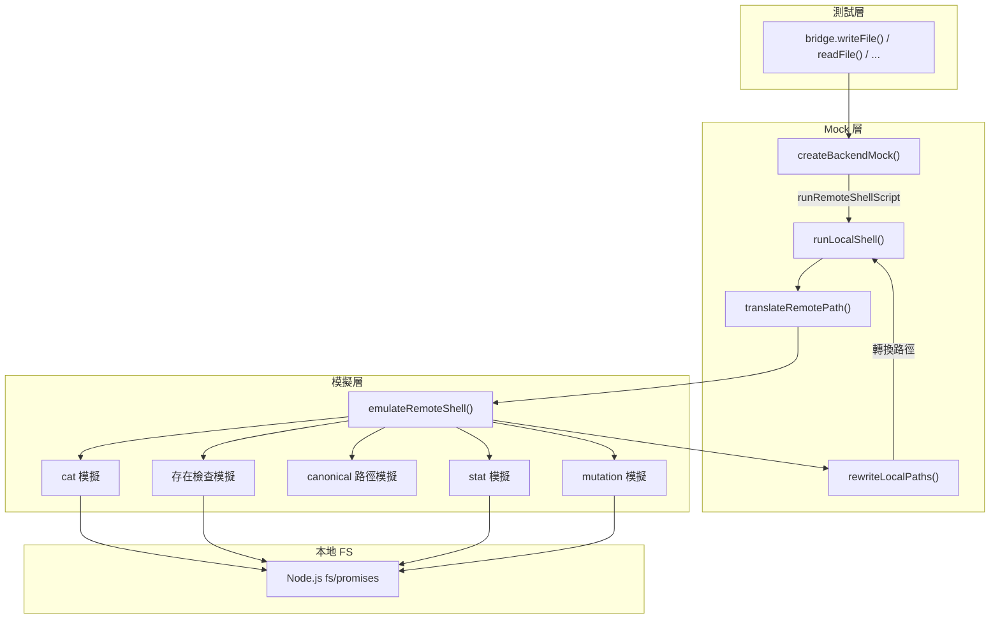
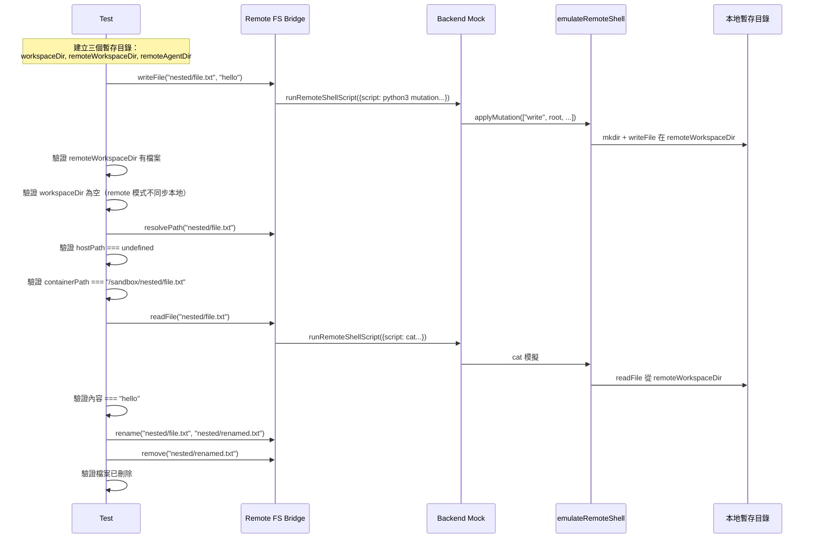

# 測試策略與近期變更

## 測試架構總覽

OpenShell 插件的測試涵蓋五個模組，每個模組有獨立的測試檔案：

```
extensions/openshell/src/
├── backend.test.ts           # Backend factory/manager 測試
├── cli.test.ts               # CLI 解析與 bundled fallback 測試
├── config.test.ts            # 組態驗證測試
├── fs-bridge.test.ts         # Mirror FS Bridge 測試
└── remote-fs-bridge.test.ts  # Remote FS Bridge 測試（含 shell 模擬器）
```

### 測試覆蓋矩陣

| 模組 | 測試數 | 關鍵測試項目 |
|------|--------|-------------|
| `config` | 4 | 預設值套用、remote 模式、相對路徑拒絕、無效模式拒絕 |
| `cli` | 5 | Base argv、gateway 旗標、bundled 優先、PATH 回退、shell 逸出 |
| `backend` | 2 | Runtime 狀態查詢（含 config 覆寫）、Runtime 刪除 |
| `fs-bridge` | 3 | 檔案寫入+本地同步、agent 掛載映射、雙掛載路徑解析 |
| `remote-fs-bridge` | 1 (綜合) | 寫入、讀取、重命名、刪除、stat -- 無本地 hostPath |

## Shell 模擬器（emulateRemoteShell）

這是 `remote-fs-bridge.test.ts` 中最精巧的設計。為了避免測試依賴真實的 SSH 連線和 OpenShell CLI，測試使用一個完全 in-process 的 shell 模擬器。

### 設計動機

```
原始問題：
remote-fs-bridge.test.ts 測試需要呼叫 runRemoteShellScript()
→ 實際上會透過 SSH 執行 shell script
→ 需要真實的 OpenShell sandbox

解決方案：
Mock backend.runRemoteShellScript()
→ 導向 runLocalShell()
→ 轉換遠端路徑為本地暫存路徑
→ 用 emulateRemoteShell() 模擬 shell 行為
→ 回傳結果中將本地路徑改寫回遠端路徑
```

### 架構圖



### 路徑轉換

測試使用暫存目錄模擬遠端環境，`translateRemotePath()` 負責轉換：

```typescript
function translateRemotePath(
  value: string,
  roots: { workspace: string; agent: string }
) {
  // /sandbox/file.txt → /tmp/workspace-xxx/file.txt
  if (value === "/sandbox" || value.startsWith("/sandbox/")) {
    return path.join(roots.workspace, value.slice("/sandbox".length));
  }
  // /agent/data.bin → /tmp/agent-xxx/data.bin
  if (value === "/agent" || value.startsWith("/agent/")) {
    return path.join(roots.agent, value.slice("/agent".length));
  }
  return value;
}
```

輸出結果中再反向轉換：

```typescript
function rewriteLocalPaths(
  value: string,
  roots: { workspace: string; agent: string }
) {
  return value
    .replaceAll(roots.workspace, "/sandbox")
    .replaceAll(roots.agent, "/agent");
}
```

### Shell Script 模式匹配

`emulateRemoteShell()` 根據 script 內容匹配不同的操作：

```typescript
async function emulateRemoteShell(params) {
  // 1. 讀取檔案
  if (params.script === 'set -eu\ncat -- "$1"') {
    return { stdout: await fs.readFile(params.args[0]), ... };
  }

  // 2. 檔案存在檢查
  if (params.script === 'if [ -e "$1" ] || [ -L "$1" ]; then ...') {
    const exists = await pathExistsOrSymlink(target);
    return { stdout: Buffer.from(exists ? "1\n" : "0\n"), ... };
  }

  // 3. Canonical 路徑解析
  if (params.script.includes('canonical=$(readlink -f -- "$cursor")')) {
    const canonical = await resolveCanonicalPath(args[0], args[1] === "1");
    return { stdout: Buffer.from(`${canonical}\n`), ... };
  }

  // 4. Stat（類型+硬連結數）
  if (params.script.includes('stats=$(stat -c "%F|%h" -- "$1")')) {
    const stats = await fs.lstat(target);
    return { stdout: Buffer.from(`${describeKind(stats)}|${stats.nlink}\n`), ... };
  }

  // 5. Stat（類型+大小+修改時間）
  if (params.script.includes('stat -c "%F|%s|%Y" -- "$1"')) {
    const stats = await fs.lstat(target);
    return { stdout: Buffer.from(
      `${describeKind(stats)}|${stats.size}|${Math.trunc(stats.mtimeMs / 1000)}\n`
    ), ... };
  }

  // 6. Python3 mutation script
  if (params.script.includes("python3 /dev/fd/3")) {
    await applyMutation(params.args, params.stdin);
    return { stdout: Buffer.alloc(0), ... };
  }

  throw new Error(`unsupported remote shell script: ${params.script}`);
}
```

### Mutation 操作模擬

```typescript
async function applyMutation(args: string[], stdin?: Buffer) {
  const operation = args[0];

  if (operation === "write") {
    const [root, relativeParent, basename, mkdir] = args.slice(1);
    const parent = path.join(root, relativeParent);
    if (mkdir === "1") await fs.mkdir(parent, { recursive: true });
    await fs.writeFile(path.join(parent, basename), stdin ?? Buffer.alloc(0));
  }

  if (operation === "mkdirp") {
    const [root, relativePath] = args.slice(1);
    await fs.mkdir(path.join(root, relativePath), { recursive: true });
  }

  if (operation === "remove") {
    const [root, relativeParent, basename, recursive, force] = args.slice(1);
    const target = path.join(root, relativeParent, basename);
    await fs.rm(target, { recursive: recursive === "1", force: force !== "0" });
  }

  if (operation === "rename") {
    const [srcRoot, srcParent, srcBase, dstRoot, dstParent, dstBase, mkdir] = args.slice(1);
    const source = path.join(srcRoot, srcParent, srcBase);
    const destinationParent = path.join(dstRoot, dstParent);
    if (mkdir === "1") await fs.mkdir(destinationParent, { recursive: true });
    await fs.rename(source, path.join(destinationParent, dstBase));
  }
}
```

### 綜合測試流程



## 近期變更分析（2026-03-23）

以下三個 commit 構成了近期最重要的 openshell 變更：

### Commit 1: fix(openshell): bundle upstream cli fallback

**影響檔案：**
- `extensions/openshell/src/cli.ts` (+44/-1)
- `extensions/openshell/src/cli.test.ts` (+26/-2)
- `package.json` (+3/-0)
- `pnpm-lock.yaml` (+101/-0)

**變更內容：**

這是最具實質性的改動。引入了 bundled CLI 解析機制：

```
之前：
  resolveOpenShellCommand("openshell") → "openshell"（直接回傳）
  唯一解析方式是系統 PATH

之後：
  resolveOpenShellCommand("openshell")
    → resolveBundledOpenShellCommand()
      → require.resolve("openshell/package.json")
      → 讀取 bin 欄位
      → 轉為絕對路徑
    → 找不到時回退至 "openshell"
```

新增了 `resolveBundledOpenShellCommand()` 函式、快取機制、測試注入點 `setBundledOpenShellCommandResolverForTest()`，以及三個測試案例。

**為什麼需要這個改動？**

在某些部署環境（例如容器化部署、CI runner），`openshell` 可能不在系統 PATH 中，但作為 npm 依賴已經安裝在 `node_modules` 裡。bundled fallback 機制確保插件能自動找到並使用這個 bundled 版本。

### Commit 2: fix(test): unblock openshell remote fs bridge

**影響檔案：**
- `extensions/openshell/src/remote-fs-bridge.test.ts` (+14/-4)

**變更內容：**

修復了 remote-fs-bridge 測試在 CI 環境中被阻塞的問題。這是迭代改進的第一步。

### Commit 3: fix(test): speed up openshell remote fs bridge

**影響檔案：**
- `extensions/openshell/src/remote-fs-bridge.test.ts` (+153/-66)

**變更內容：**

這是對測試架構的大幅重構。將原本依賴真實 shell 子程序的測試工具替換為完全 in-process 的 `emulateRemoteShell` 模擬器：

```
之前：
  runLocalShell() → child_process.exec() → 真實 shell 執行
  問題：慢、不穩定、CI 環境中可能失敗

之後：
  runLocalShell() → emulateRemoteShell() → Node.js fs 操作
  優點：快速、確定性、無外部依賴
```

新增的模擬器覆蓋了所有 Remote FS Bridge 使用的 shell script 模式（cat、exists、readlink、stat、python3 mutation），使測試速度大幅提升且在 CI 中更加可靠。

### 變更時間線

```mermaid
gantt
    title OpenShell 近期變更（2026-03-23）
    dateFormat HH:mm
    axisFormat %H:%M

    section 測試修復
    unblock remote fs bridge    :done, 01:13, 01:38
    speed up remote fs bridge   :done, 01:38, 02:18

    section 功能
    bundle upstream cli fallback :done, 02:18, 02:45
```



## 執行測試

### 單一模組測試

```bash
# 測試 CLI 模組
pnpm test -- extensions/openshell/src/cli.test.ts

# 測試 Remote FS Bridge
pnpm test -- extensions/openshell/src/remote-fs-bridge.test.ts

# 測試所有 openshell 模組
pnpm test -- extensions/openshell/
```

### 測試環境設定

如果遇到記憶體壓力：

```bash
OPENCLAW_TEST_PROFILE=low OPENCLAW_TEST_SERIAL_GATEWAY=1 \
  pnpm test -- extensions/openshell/
```

### 撰寫新測試的注意事項

1. **清理暫存目錄**：使用 `afterEach` 確保暫存目錄被刪除
2. **Mock CLI 呼叫**：使用 `vi.fn()` mock `runOpenShellCli`，避免真實 CLI 呼叫
3. **重置 bundled resolver**：每個 CLI 測試後呼叫 `setBundledOpenShellCommandResolverForTest(undefined)`
4. **使用 `createSandboxTestContext`**：從 `test-fixtures.js` 引入標準測試上下文
5. **遵循 `--isolate=false` 相容性**：測試必須清理 timers、env、globals、mocks

### 測試模式對照

| 你想測試的 | 使用的 Mock/Fixture | 範例檔案 |
|-----------|-------------------|---------|
| CLI 指令建構 | `setBundledOpenShellCommandResolverForTest` | `cli.test.ts` |
| 沙箱狀態查詢 | `vi.mock()` mock `runOpenShellCli` | `backend.test.ts` |
| Mirror 檔案操作 | `vi.fn()` mock `syncLocalPathToRemote` | `fs-bridge.test.ts` |
| Remote 檔案操作 | `createBackendMock()` + `emulateRemoteShell` | `remote-fs-bridge.test.ts` |
| 組態驗證 | 直接呼叫 `resolveOpenShellPluginConfig()` | `config.test.ts` |

## 貢獻指南

### 新增 CLI 操作

1. 在 `cli.ts` 新增 helper 函式
2. 在 `cli.test.ts` 新增對應測試
3. 確認 bundled fallback 仍然正常運作

### 新增 Remote Shell Script

1. 在 Plugin SDK 或 `backend.ts` 新增 script
2. 在 `emulateRemoteShell()` 新增匹配邏輯
3. 在 `remote-fs-bridge.test.ts` 驗證端到端行為

### 修改組態 Schema

1. 更新 `config.ts` 的型別與驗證邏輯
2. 更新 `openclaw.plugin.json` 的 schema 與 uiHints
3. 更新 `config.test.ts` 驗證新欄位
4. 執行 `pnpm plugin-sdk:api:gen` 檢查是否有 API surface 漂移
